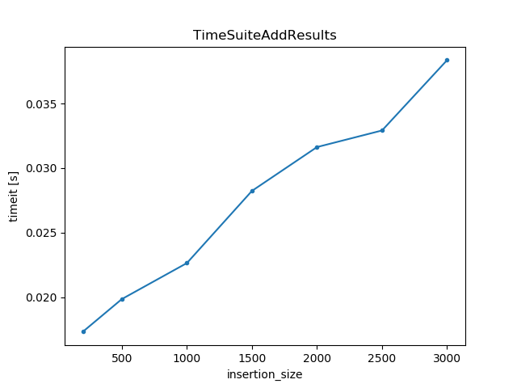
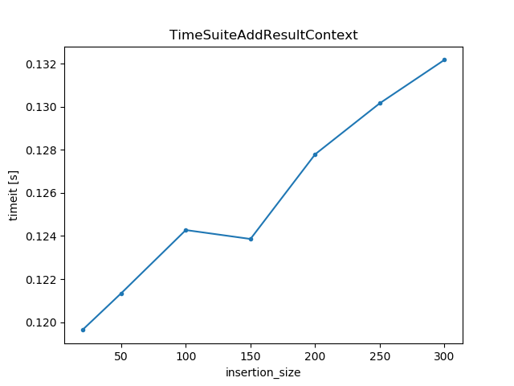
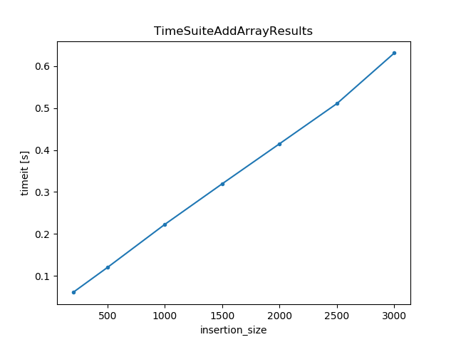
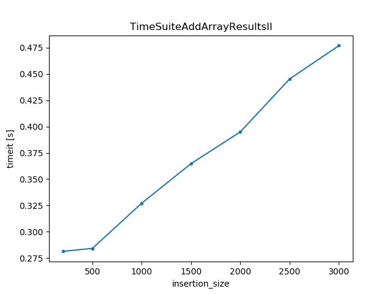
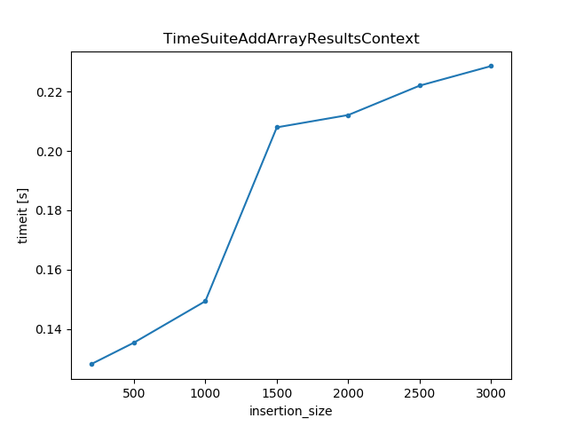

Benchmark results 
=================

.. code-block:: python

    def time_range(self, insertion_size):
        """
        We test the insertion time as a function of the number of results we generate. Add all results in one sql
        command using the "add_results" method (notice the plural "s")
        """
        t_values = np.linspace(-1, 1, insertion_size)
        results = [{"t": t, "x": 2 * t ** 2 + 1} for t in t_values]
        self._data_set.add_results(results)
.. image:: TimeSuiteAddResult.png
	:width: 1000px
	:align: center
	:height: 800px

.. code-block:: python

    def time_range(self, insertion_size):
        """
        We test the insertion time as a function of the number of results we generate. Then, add the results in one by
        one on a loop by calling "add_result". Contrast this with the plot "TimeSuiteAddResults"; we see that this
        method is ~200 times slower!
        """
        t_values = np.linspace(-1, 1, insertion_size)
        results = [{"t": t, "x": 2 * t ** 2 + 1} for t in t_values]

        for result in results:
            self._data_set.add_result(result)

.. code-block:: python

    def time_range(self, insertion_size):
        """
        Use the context manager to add results in a data set. Compare this result with the "TimeSuiteAddResult" and
        "TimeSuiteAddResults". We see that although it is not as slow as the former, it is still much slower then the
        latter.
        TODO: We should find out why this is so much slower.
        """
        with self._meas.run() as datasaver:
            for ix, im in zip(range(insertion_size), range(insertion_size)):
                datasaver.add_result((self._x, ix), (self._m, im))

.. code-block:: python

    def time_range(self, insertion_size):
        """
        Insert arrayed valued values. Each result contains a 1x2 array. Again we see that this is much slower then
        inserting single valued results.
        """
        t_values = np.linspace(-1, 1, insertion_size)
        results = [{"t": t, "x": np.array([2 * t**2 + 1, t**3 - 1])} for t in t_values]
        self._data_set.add_results(results)

.. code-block:: python

    def time_range(self, insertion_size):
        """
        Insert arrayed valued values. The dimensionality of the array increases along the x-axis.
        """
        t_values = np.linspace(-1, 1, 1000)
        results = [{"t": t, "x": np.random.uniform(0, 1, (1, insertion_size))} for t in t_values]
        self._data_set.add_results(results)

.. code-block:: python

    def time_range(self, insertion_size):
        """
        Add array valued results with the context manager.
        """
        self._x(0)
        self._m.get = lambda: np.arange(insertion_size)

        with self._meas.run() as datasaver:
            datasaver.add_result((self._x, self._x()), (self._m, self._m()))
