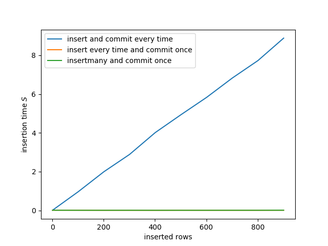

Sqlite insertion benchmarks
===========================

These experiments we carried out on a windows machine. 
Running these experiments on another system might yield different results.

Benchmarking the effect of committing
-------------------------------------

The orange line lies below the green line.
The blue and orange graphs each have

.. code:: python

	cur.execute(query, value)

inside a for loop, while the green graph uses

.. code:: python

	cur.executemany(query, values)

The difference between the blue and orange graph is that we commit for every insertion in the blue and we commit only once for the orange after all insertions.

From this we learn that one should only commit once after all queries have been executed.
This approach is constant time in contrast to committing every iteration which is linear time.

Benchmarking for random lookups
-------------------------------

This plot shows the time it takes to select 5% of the number of records.
The selected records are chosen at random.
The difference between the graphs is that we only fetch after executing the select statement for the blue graph and that we also commit afterwards for the orange graph.

There is no overhead of comitting when doing lookups.
On the other hand there is no reason to commit when there are no changes.

Insertion speed vs. number of rows
----------------------------------

.. image:: insertion_speed_vs_nrows_2_240000.png

This plot shows the insertion speed for 2 columns
The lines correspond to the three methods

.. code:: python

	cur.executemany(query, values)

.. code:: python

	cur.execute(query, values)

.. code:: python

	cur.executescript(script)

The execute method call is used as in sqlite_base.
The variable mvn stands for the MAX_VARIABLE_NUMBER from the SQLiteSettings.
Wee see that the fastest approach is the one already implemented. 
It makes no difference to dynamically change the mvn. The same speed is achieved.

This plot shows the insertion speed for 100 columns.
The difference between the different approaches is smaller when the number of columns increases.

Insertion speed vs. number of columns
-------------------------------------

This plot shows the insertion speed for 10000 rows.

Insertion speed vs. MAX_VARIABLE_NUMBER
---------------------------------------

This plot shows how the insertion speed of 

.. code:: python

	cur.execute(query, values)

as implemented in sqlite_base when dynamically varying MAX_VARIABLE_NUMBER. The insertion time does not change when dynamically changing the MAX_VARIABLE_NUMBER.

This plot shows a real benchmark of existing code. The plot is specified by the following function.

.. code:: python

	def benchmark_add_results_vs_MAX_VARIABLE_NUMBER():
	    filename = 'benchmark_add_results_vs_MAX_VARIABLE_NUMBER.png'
	    if no_plots:
	        return filename
	    plt.figure()
	    xr, yr = [], []
	
	    mvn = qc.SQLiteSettings.limits['MAX_VARIABLE_NUMBER']
	    for i in range(2, mvn, mvn//50):
	        ts = []
	        for j in range(3):
	            qc.SQLiteSettings.limits['MAX_VARIABLE_NUMBER'] = i
	            new_experiment("profile", "profile")
	            data_set = new_data_set("stress_test_simple")
	
	            t1 = ParamSpec('t', 'numeric', label='time', unit='s')
	            x = ParamSpec('x', 'numeric',
	                          label='voltage', unit='v', depends_on=[t1])
	
	            data_set.add_parameter(t1)
	            data_set.add_parameter(x)
	            insertion_size = 400 * 600
	            t_values = np.linspace(-1, 1, insertion_size)
	            results = [{"t": t, "x": 2 * t ** 2 + 1} for t in t_values]
	
	            t1r = time.time()
	            data_set.add_results(results)
	            t = time.time() - t1r
	            ts.append(t)
	        xr.append(i)
	        yr.append(mean(ts))
	
	    plt.plot(xr, yr)
	    plt.ylabel('execution time of data_set.add_results(result)')
	    plt.xlabel('MAX_VARIABLE_NUMBER')
	    plt.savefig(filename)
	    return filename
	

As long as the mvn is not set too low it does not matter what it is set to. The default value of 1000 is fine.
