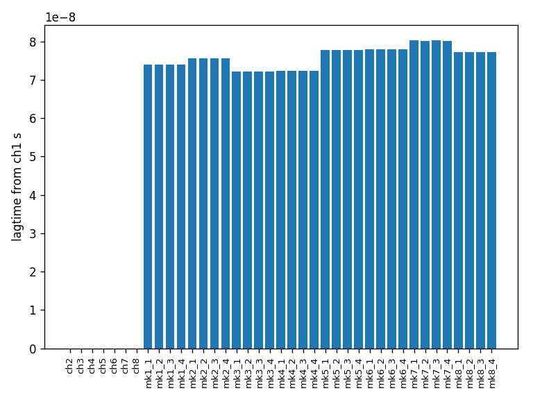
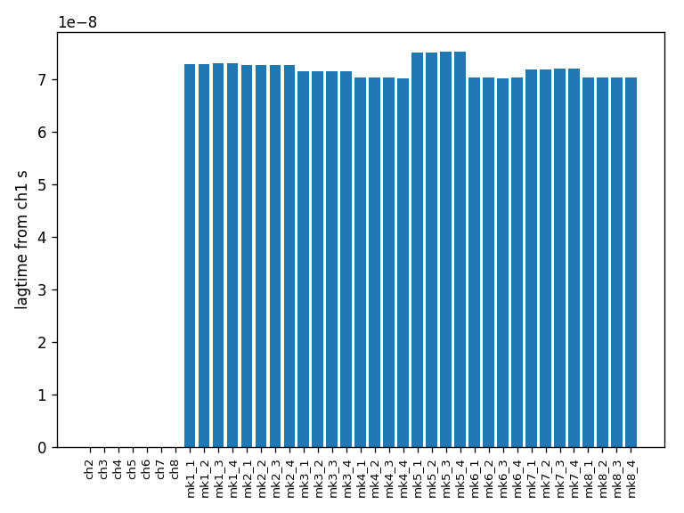
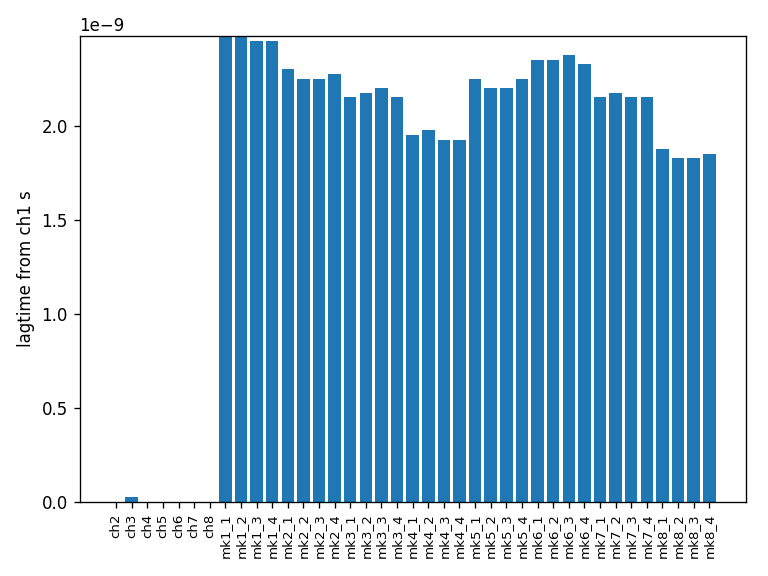

Lag time between channels and markers on the AWG5208
=====================================================

Abstract
---------

We have measured the lag times between the different channels and the marker channels
of the AWG5208 for three different versions of the firmware: 6.0, 6.10054 and 6.10061.
The lag times between the channels are negligible. The lag times between the markers
and channel one of the AWG were around 74 nano seconds for the firmware version 6.0
and 6.10054. The same lag times were around 2.2 nano seconds for the firmware version 6.10061.

Setup
------

The setup consisted of a  Keysight Infiniium MSOS104A mixed signal oscilloscope
connected with four bnc to sma adapters and the adapters were connected
with the Tektronix 5208 arbitrary waveform generator through four identical sma cables.
Channel one of the AWG was all the time connected to the channel one input on the
oscilloscope and was used as a base reference.

A program was written to upload the same waveform to all the eight channels of the AWG.
The waveform chosen was a square wave. The same wave was also chosen for the marker
channels.

A measurement of all channels and marker channels was conducted. This was done by connecting four channels of the AWG to the four inputs on the oscilloscope. Then a program
was executed, polling the scope for the waveforms and saving the result on the computer.
This process was done again and again for the different outputs on the AWG.

The firmware of the AWG was then updated to version 6.10054 and the measurement was repeated. This was done again after the firmware of the AWG was updated to version 6.10061.

Results
--------

For each of the channels on the AWG except for channel one the crosscorrelation was computed
between channel one and the channel. By taking argmax of the crosscorrelation and subtracting half the length of the crosscorrelation the lag could be computed by multiplying this value with the time increment of the time axis.

This was done for the three different versions of firmware.

    Lag time in seconds between the different channels and channel one for version 6.0 of the firmware

    Lag time in seconds between the different channels and channel one for version 6.10054 of the firmware

    Lag time in seconds between the different channels and channel one for version 6.0061 of the firmware

Conclusion
-----------

The installation of the firmware version 6.0054 did not seem to help with the lag between the channels and the marker channels. Before and after the installation the mean of the lag times of the marker channels was 76 and 72 ns. After installation of firmware version 6.0061 the mean of the lag times of the marker channels was 2.2 ns, which is a considerable improvement.
