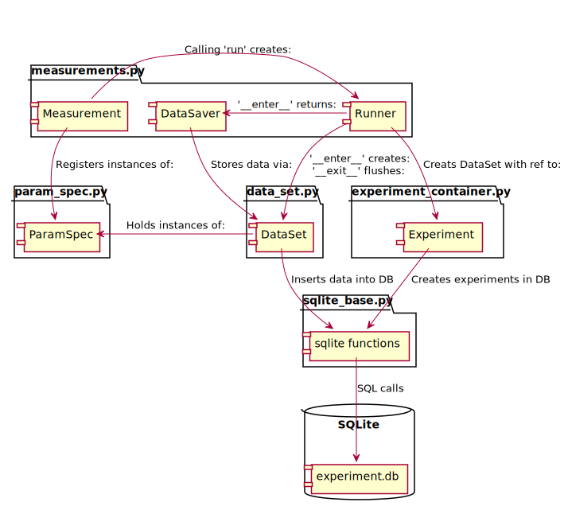

.. highlight:: python

.. _datasetdesign:

==============
Dataset Design
==============

.. _sec:design_introduction:

Introduction
============

.. _datasetdiagram:

   Basic workflow

This document aims to explain the design and working of the QCoDeS DataSet.
In :numref:`datasetdiagram` we sketch the basic design of the dataset.
The dataset implementation is organised in 3 layers shown vertically in
:numref:`datasetdiagram` Each of the layers implements functionality for
reading and writing to the dataset. The layers are organised hierarchically
with the top most one implementing a high level interface and the lowest
layer implementing the communication with the database. This is done in order
to facilitate two competing requirements. On one hand the dataset should
be easy to use enabling simple and easy to use functionality for performing
standard measurements with a minimum of typing. On the other hand the dataset
should enable users to perform any measurement that they may find useful.
It should not force the user into a specific measurement pattern that may be
suboptimal for more advanced use cases. Specifically it should possible to
formulate any experiment as python code using standard language constructs
(for and while loops among others) with a minimal effort.

The legacy QCoDeS dataset ``qcodes.data`` and loop ``qcodes.Loop`` is
primarily oriented towards ease of use for the standard use case but makes
it challenging to formulate more complicated experiments without significant
work reformatting the experiments in a counterintuitive way.

The QCoDeS dataset currently implements two
interfaces directly targeting end users. It is not expected that the user
of QCoDeS will need to interface directly with the lowest layer communicating
with the database.

The ``dataset`` layer defined in the :ref:`dataset-spec` provides the most
flexible user facing layer. Insert reference to notebook. but requires users
to manually register `ParamSpecs`. The dataset implements two functions for
inserting one or more rows of data into the dataset and immediately writes it
to disk. It is, however, the users responsibility to ensure good performance
by writing to disk at suitable intervals.

The measurement context manager layer provides additional support for flushing
data to disk at selected intervals for better performance without manual
intervention. It also provides easy registration of ParamSpecs on
the basis of QCoDeS parameters or custom parameters.

But importantly it does not:

* Automatically infer the relationship between dependent and independent
  parameters. The user must supply this metadata for correct plotting.
* Automatically register parameters.
* Enforce any structure on the measured data. (1D, on a grid ect.)
  This may make plotting more difficult as any structure will have to

It is envisioned that a future layer is added on top of the existing layers
to automatically register parameters and save data at the cost of being
able to write the measurement routine as pure python functions.

We note that the dataset currently exclusively supports storing data in an
SQLite database. This is not an intrinsic limitation of the dataset and
measurement layer. It is possible that at a future state support for writing
to a different backend will be added.

