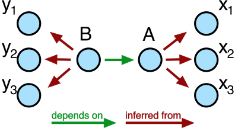
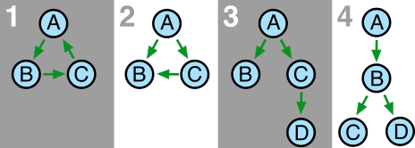
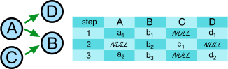
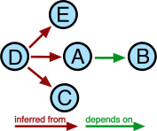
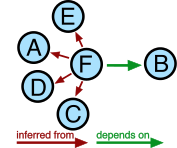

.. highlight:: python

.. _interdependentparams:

=========================
Interdependent Parameters
=========================

.. _sec:introduction:

Introduction
============

At the heart of a measurement lies the concept of dependent and
independent variables. A physics experiment consists in its core of
varying something and observing how something else changes depending on
that first varied thing. For the QCoDeS dataset to be a faithful
representation of actual physics experiments, the dataset must preserve
this notion of dependencies. In this small note, we present some
thoughts on this subject and present the current state of the dataset.

.. _sec:sett-gener-stage:

Setting the general stage
=========================

In the general case, an experiment looks as follows. We seek to study
how :math:`B` depends on :math:`A`. Unfortunately, we can neither set
:math:`A` nor measure :math:`B`. What we *can* do, however, is to vary
:math:`n` parameters :math:`x_1,x_2,\ldots,x_n` (:math:`\boldsymbol{x}`
for brevity) and make the assumption that :math:`A=A(\boldsymbol{x})`.
Similarly, we have access to measure :math:`m` other parameters,
:math:`y_1,y_2,\ldots,y_m` (:math:`\boldsymbol{y}` for brevity) and
assume that :math:`B=B(\boldsymbol{y})`. It generally holds that each
:math:`y_i` depends on :math:`\boldsymbol{x}`, although many such
dependencies may be trivial [1]_. Given :math:`\boldsymbol{x}` and
:math:`\boldsymbol{y}` (i.e. a laboratory) it is by no means an easy
exercise to find a relation :math:`A(B)` for which the above assumptions
hold. That search is indeed the whole exercise of experimental physics,
but as far as QCoDeS and the dataset is concerned, we must take for
granted that :math:`A` and :math:`B` exist and satisfy the assumptions.

.. _sec:good-scient-pract:

Good scientific practice and measurement intentions
===================================================

In this section, we assume :math:`A` and :math:`B` to be scalars. We
treat the general case in the next section.

In a measurement of :math:`B` versus :math:`A`, it seems tempting to
simply only write down the values of :math:`A` and :math:`B`, declare
that :math:`A` is abscissa for :math:`B`, and make a nice plot.
Responsible scientific conduct principles however urge us to write down
*everything we did*, which in terms of data saving amounts to also
storing :math:`\boldsymbol{x}` and :math:`\boldsymbol{y}`. At the same
time, we would like the dataset to reflect the *intention* of
measurement, meaning what the measurement is supposed to be about,
namely that it measures :math:`B` versus :math:`A`. Currently, this is
handled by the dataset by declaring that :math:`B` *depends on*
:math:`A` whereas :math:`A` is *inferred from* :math:`\boldsymbol{x}`
and :math:`B` is *inferred from* :math:`\boldsymbol{y}`. In code, we set
up the measurement like

::

      meas = Measurement()
      meas.register_parameter(x1)
      meas.register_parameter(x2)
      meas.register_parameter(x3) # and so on
      meas.register_parameter(y1)
      meas.register_parameter(y2)
      meas.register_parameter(y3) # etc
      meas.register_parameter(A, inferred_from(x1, x2, x3))
      meas.register_parameter(B, depends_on=(A,),
                              inferred_from=(y1, y2, y3))

This is shown graphically in :numref:`fig_gen`.

.. _fig_gen:

   A drawing of the general setting

The default plotter included in the dataset will understand the
dependencies and plot :math:`B` versus :math:`A`.

.. _sec:higher-dimension:

Higher dimension
================

In the previous section, :math:`A` was to assumed to be a scalar. In the
general case, the true independent variables :math:`\boldsymbol{x}` can
be grouped together in :math:`k` different variables,
:math:`A_1,\ldots,A_k` that represent the intention of the measurement.
An example would be a heatmap plotting a demodulated signal as a
function of two gate voltage axes. To describe a measurement of
:math:`B` as :math:`A_1` and :math:`A_2` are varied, we set up the
measurement like

::

      meas = Measurement()
      meas.register_parameter(x1)
      meas.register_parameter(x2)  # and so on
      meas.register_parameter(y1)
      meas.register_parameter(y2)  # etc
      meas.register_parameter(A1, inferred_from(x1, x2))
      meas.register_parameter(A2, inferred_from(x1, x2))
      meas.register_parameter(B, depends_on=(A1, A2),
                              inferred_from=(y1, y2))

Graphically:

.. _fig_dep_02:
.. figure:: figures/dependencies_02.svg
   :alt: A heatmap
   :align: center
   :width: 60.0%

   A heatmap

It may of course very well be that e.g. :math:`A_1=x_1` in which case
there is no point of having inferred parameter for :math:`A_1`.

.. _sec:that-really-necess:

Is that really necessary?
=========================

It should be clear that the ``inferred_from`` notion is a kind of
metadata. It describes a relation between the raw values that the
experimentalist can control and the desired outcome of an experiment. It
is **not** required by the dataset to have any inferred variables, but
we stress that it is unscientific to throw away raw measurement data.
Whatever raw values are recorded should thus be saved along with the
“interesting” parameter values, and the ``inferred_from`` tagging is
simply a way of declaring what is derived from where.

In a perfect world, an auxiliary laboratory notebook contains all the
information needed to *exactly* reproduce the experiment, and the
dataset needs only store the numerical values of parameters and nothing
else. In a sort of pragmatic recognition of how actual laboratories
usually work, we have decided to put some metadata directly into the
dataset. Specifically, we want the dataset to be able to hold
information about

-  What the experimenter wishes to study as a function of what
   (expressed via ``depends_on``).

-  What corresponds to a raw machine setting/reading (expressed via
   ``inferred_from``).

As complexity of the experiments grow, the second notion can be
difficult to uphold. It is offered as a help to ensure good scientific
practice.

It is important to note that the dataset can freely be used without
*any* declarations of dependencies of either sort.

.. _sec:plotting:

Plotting
========

Besides being optional metadata describing the correct interpretation of
measurement data, the direct dependencies (expressed via ``depends_on``)
are used to generate the *default plot*. We estimate that for the vast
majority of measurements to be stored in the dataset, the
experimentalist will want to be able to plot the data as they are coming
in and also have the ability to quickly bring up a plot of a particular
measurement without specifying more than the id of said measurement.
This necessitates the declaration, in the dataset itself, of what should
be plotted against what. The direct dependencies can thus be understood
in the following way: :math:`A` depends on :math:`B` and :math:`C` means
that the default plot is of :math:`A` with :math:`B` on one axis and
:math:`C` on the other.

Although visual plotting is not tractable for an arbitrary amount of
axes, we promote the principle of having a default plot to be a logical
principle about which dependencies we allow: only those resulting in a
meaningful (perhaps :math:`N`-dimensional) default plot are allowed.

.. _sec:all-possible-trees:

All possible trees
==================

Now that we have established a language for describing connections
between parameters, and also described our aim in terms of plotting and
metadat, let us review what the dataset does and does not allow.

It follows from the consideration of section :ref:`sec:plotting` that
the dataset allows for a *single* layer of direct dependencies. The
trees shown in :numref:`bad_trees` are therefore
all invalid and can **not** be stored in the dataset.

.. _bad_trees:

   Not acceptable direct dependencies

A few words explaining why are in place.

#. Circular dependence. There is no way of telling what is varied and
   what is measured.

#. Independent parameters not independent. Although :math:`A` clearly
   sits on top of the tree, the two independent variables are not
   independent. It is not clear whether :math:`C` is being varied or
   measured. It is ambiguous whether this describes one plot of
   :math:`A` with :math:`B` and :math:`C` as axes or two plots, one of
   :math:`A` versus :math:`B` and another of :math:`C` versus :math:`B`
   or even both situations at once.

#. Similarly to situation 2, :math:`C` is ill-defined.

#. :math:`B` is ill-defined, and it is not clear what :math:`A` should
   be plotted against.

It is perhaps instructive to see how the above trees could be remedied.
In :numref:`bad_trees_remedied` we show
all possible valid reconfigurations that neither invert any arrows nor
leave any parameters completely decoupled [2]_. The fact that each tree
of :numref:`bad_trees` has several valid
reconfigurations exactly illustrates the ambiguity of those trees [3]_.

In column **c** of
:numref:`bad_trees_remedied` we see two
somewhat new graphs. In **2c**, we allow two variables to depend on a
third one. There is no ambiguity here, two plots will result from this
measurement: :math:`A` versus :math:`B` and :math:`C` versus :math:`B`.
Similarly, in **3c** we’ll get :math:`A` versus :math:`B` and :math:`C`
versus :math:`D`. The total number of trees and plots per dataset is
treated in the next section.

.. _bad_trees_remedied:
.. figure:: figures/bad_trees_remedied.svg
   :alt: Acceptable recastings of the dependencies of :numref:`bad_trees`. The pathological tree 1 is omitted.
   :align: center
   :width: 85.0%

   Acceptable recastings of the dependencies of
   :numref:`bad_trees`. The pathological tree 1 is
   omitted.

.. _sec:number-trees-per:

Number of trees per dataset
===========================

The dataset can hold an arbitrary number of “top-level” parameters,
meaning parameters with arrows only going out of them, parameters on
which nothing depends. At each step of the experiment, all parameters
that such a top-level parameter points to must be assigned values, if
the top-level parameter gets assigned a value. Otherwise, they may be
omitted. What this means in practice is illustrated in
:numref:`good_trees_complex`.

.. _good_trees_complex:

   A more complex sweep example. The blue rectangles represent the
   results table in the database.

We may say that this dataset de facto contains two trees, one
:math:`A-B-D` tree and one :math:`C-B` tree [4]_ . One dataset can hold
as many such trees as desired. In code,
:numref:`good_trees_complex` might take the following form:

::

      meas = Measurement()
      meas.register_parameter(D)
      meas.register_parameter(B)
      meas.register_parameter(A, depends_on=(B, D))
      meas.register_parameter(C, depends_on=(B,))

      with meas.run() as datasaver:
          for b_val in b_vals:
              for d_val in d_vals:
                  B.set(b_val)
                  D.set(d_val)
                  a_val = A.get()
                  datasaver.add_result((A, a_val),
                                       (B, b_val),
                                       (D, d_val))
                  c_val = C.get()
                  datasaver.add_result((C, c_val),
                                       (B, b_val))

.. _sec:few-examples:

A few examples
==============

Finally, to offer some intuition for the dataset’s dependency structure,
we cast a few real-life examples of measurements into tree diagrams.

.. _sec:cond-meas:

Conductance measurement
-----------------------

In a conductance measurement measuring conductance as a function of gate
voltage, a gate voltage, :math:`V_\text{gate}`, is swept while a lock-in
amplifier drives the DUT at a certain frequency with a drive amplitude
:math:`V_\text{drive}`. The drive induces a current which oscillates at
the drive frequency. An I-V converter converts that oscillating current
back into an oscillating voltage (which a certain gain factor,
:math:`G_{IV}`, with units :math:`A/V`), and that voltage is fed back
into the lock-in. Assuming no phase shift, the lock-in amplifier’s
:math:`X` reading is then related to the conductance, :math:`g`,
according to

.. math:: g = \frac{X}{V_\text{drive}G_{IV}}.

The corresponding parameter tree is shown in
:numref:`example1_conductance`, where :math:`A` is :math:`g`,
:math:`B` is :math:`V_\text{gate}`, and :math:`C` is :math:`X`. One
could of course argue that :math:`V_\text{drive}` and :math:`G_{IV}`
should also be parameters that :math:`g` is inferred from. We suggest
the following rule: anything that is known beforehand to remain constant
throughout the *entire* run can be omitted from the dataset and written
down elsewhere [5]_. The converse also holds: anything that *does*
change during a run really *should* be saved along.

.. _example1_conductance:
.. figure:: figures/example1_conductance.svg
   :alt: Conductance measurement.
   :align: center
   :width: 40.0%

   Conductance measurement.

.. _sec:comp-sweep:

Compensatory sweeping
---------------------

An interesting example that potentially does *not* fit so nicely into
our scheme is offered by compensatory sweeping. A voltage, :math:`V_1`
is swept and a quantity :math:`S` is measured. Since sweeping
:math:`V_1` has some undesired effect on the physical system, a
compensatory change of another voltage, :math:`V_2` is performed at the
same time. :math:`V_2` changes with :math:`V_1` according to

.. math:: V_2 = \alpha V_1 + \beta.

Since both :math:`\alpha` and :math:`\beta` might change during the run
via some feedback mechanism, we have four parameters apart from :math:`S`
to sort out.

There are two ways to go about this.

.. _sec:decoupling:

Decoupling
~~~~~~~~~~

If the experimentalist really insists that the interesting plot for this
measurement is that of :math:`S` versus :math:`V_1` and the compensation
is just some unfortunate but necessary circumstance, then the unusual
tree of :numref:`example2_compensation_A` is the correct
representation.

.. _example2_compensation_A:

   Sweeping a voltage with compensation in the background. :math:`A` is
   :math:`V_1`, :math:`B` is :math:`S`, :math:`D` is :math:`V_2`,
   :math:`C` is :math:`\alpha`, and :math:`E` is :math:`\beta`.

The tree of :numref:`example2_compensation_A` does fit into the
scheme of :numref:`fig_gen`, the scheme we promised to
represent the most general setting. There are now two possibilities.
Either *we* were initially wrong and no dependencies save for those
specifying the default plot can be defined for this measurement. Else
*the experimentalist* is wrong, and has an untrue representation of the
experiment in mind. We explore that idea in below in  :ref:`sec:restructuring`.

.. _sec:restructuring:

Restructuring
~~~~~~~~~~~~~

If the space spanned by :math:`V_1` and :math:`V_2` has a meaningful
physical interpretation [6]_, it might make more sense to define a new
parameter, :math:`V_3` that represents the path swept along in that
space. After all, this is what is :math:`physically` happening,
:math:`S` is measured as a function of :math:`V_3`. Then the tree of
:numref:`example2_compensation_B` emerges.

.. _example2_compensation_B:

   Sweeping along a path in voltage space. :math:`A` is :math:`V_1`,
   :math:`B` is :math:`S`, :math:`D` is :math:`V_2`, :math:`C` is
   :math:`\alpha`, :math:`E` is :math:`\beta`, and :math:`F` is
   :math:`V_3`.

.. [1]
   That is to say, for many :math:`(i, j)`, it holds that
   :math:`\frac{\partial y_i}{\partial x_j}=0`.

.. [2]
   We repeat that the dataset can hold an arbitrary amount of decoupled
   parameters. For illustrative and combinatorical reasons (there’d
   simply be too many trees!), we omit decoupled parameters here.

.. [3]
   Note that the ambiguity could be resolved by enforcing particular
   rules of interpretation. Here we have made the *design choice* of
   disallowing ambiguity in the first instance.

.. [4]
   We note for completeness that the values for, say,
   :math:`b_1, b_2, \ldots` need not be different at each step. Perhaps
   :math:`B` represents a voltage that is kept constant as :math:`D` is
   varied.

.. [5]
   E.g. the station snapshot (in which case it is actually still in the
   dataset but not in the results table) or even a laboratory logbook
   describing the equipment.

.. [6]
   Say, for instance, :math:`V_1` and :math:`V_2` are drain and gate
   voltages and the experimentalist wants to sweep along a certain path
   inside a skewed Coulomb diamond.
