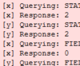
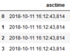

---
jupytext:
  text_representation:
    extension: .md
    format_name: myst
    format_version: 0.13
    jupytext_version: 1.14.1
kernelspec:
  display_name: Python 3
  language: python
  name: python3
---

# QCoDeS Tutorials

+++

([read on nbviewer](https://nbviewer.jupyter.org/github/QCoDeS/Qcodes/blob/master/docs/examples/Main.ipynb))

Welcome to QCoDeS! This document will help you find an overview over the available tutorials and examples. Please note that the document is under construction an will eventually popluated further. Until then don't forget to check the examples folder ([online](https://github.com/QCoDeS/Qcodes/tree/master/docs/examples))


## Logging
   Title      | description   | local link    | online link
------------- |:-------------:| -------------:|------------
 | the logger module | [offline](logging/logging_example.ipynb) | [online](https://nbviewer.jupyter.org/github/QCoDeS/Qcodes/tree/master/docs/examples/logging/logging_example.ipynb)
 | log file parsing |  [offline](logging/logfile_parsing.ipynb) | [online](https://nbviewer.jupyter.org/github/QCoDeS/Qcodes/tree/master/docs/examples/logging/logfile_parsing.ipynb)


+++

## Plotting

+++

   Title      | description   | local link    | online link
------------- |:-------------:| -------------:|------------
 | Auto color scaling | [offline](plotting/auto_color_scale.ipynb) | [online](https://nbviewer.jupyter.org/github/QCoDeS/Qcodes/tree/master/docs/examples/plotting/auto_color_scale.ipynb)

```{code-cell} ipython3

```
