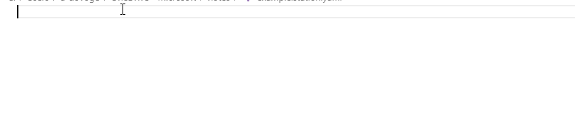

---
jupytext:
  text_representation:
    extension: .md
    format_name: myst
    format_version: 0.13
    jupytext_version: 1.14.1
kernelspec:
  display_name: Python 3 (ipykernel)
  language: python
  name: python3
---

# Station

In this tutorial, the following topics shall be covered:

- What is a station
- How to create it, and work with it
- Snapshot of a station
- Configuring station using a YAML configuration file

```{code-cell} ipython3
# Useful imports:

from pprint import pprint  # for pretty-printing python variables like 'dict'

import qcodes
from qcodes.instrument import Parameter
from qcodes.station import Station
from qcodes.tests.instrument_mocks import DummyInstrument
```

## What is a Station?

Experimental setups are generally large as they consist of many instruments. Each instrument in a given setup tends to be quite complex due to the fact that each comprises a variety of adjustable parameters and other stateful parts. As a result, it deems useful to have a bucket in which the necessary information concerning the instruments that are going to be used in a particular experiment can be conveniently stored, and accessed.

The concept of a station, in essence, is a programmatical representation of such a bucket. Instruments, parameters, and other "components" can be added to a station. The user gets a station instance that can be referred to in order to access those "components".

A station can be configured from a text file which simplifies the initialisation of the instruments. In particular, in this tutorial, we shall provide an example configuration of a station by using a YAML file.

A special use case of a station in an experiment would be the capturing of the state of an experimental setup, known as a snapshot. We shall devote a subsection for the concept of a snapshot.

+++

## How to create a Station and work with it?

Let us, first, create a dummy parameter, and a dummy instrument which we shall use throughout the tutorial.

```{code-cell} ipython3
# A dummy self-standing parameter
p = Parameter('p', label='Parameter P', unit='kg', set_cmd=None, get_cmd=None)
p.set(123)
```

```{code-cell} ipython3
# A dummy instrument with three parameters
instr = DummyInstrument('instr', gates=['input', 'output', 'gain'])
instr.gain(42)
```

### Creating a Station

+++

We create a ``Station`` object and add previously defined parameter and instrument as its components as follows:

```{code-cell} ipython3
station = Station()

station.add_component(p)
station.add_component(instr)
```

It is straightforward to verify if the station contains our parameter and instrument:

```{code-cell} ipython3
# Now station contains both `p` and `instr`
station.components
```

Note that it is also possible to add components to a station via arguments of its constructor:

```{code-cell} ipython3
station = Station(p, instr)
```

### Accessing Station components

+++

Now that the components have been added to the station, it is possible to access them as its attributes (by using the "dot" notation). With this feature, users can use tab-completion to find the instrument in the station they'd like to access.

```{code-cell} ipython3
# Let's confirm that station's `p` is
# actually the `p` parameter defined above
assert station.p is p
```

### Removing components from a Station

+++

Removing components from a station should be done with `remove_component` method - the name of the component that is to be removed should be passed as the argument of the method:

```{code-cell} ipython3
station.remove_component('p')
```

```{code-cell} ipython3
# Now station contains only `instr`
station.components
```

### Default Station

The `Station` class is designed in such a way that it always contains a reference to a `default` station object (the `Station.default` attribute). The constructor of the station object has a `default` keyword argument that allows to specify whether the resulting instance shall be stored as a default station, or not.

This feature is a convenience. Other objects which consume an instance of `Station` as an argument (for example, `Measurement`) can now implement a logic to resort to `Station.default` in case a `Station` instance was not explicitly given to them.

+++

## Snapshot of a Station

The station has a `snapshot` method that allows to create a collective, single snapshot of all the instruments, parameters, and submodules that have been added to it. It would be very time-consuming for the user to manually go through every instrument and parameter, and collect the snapshot data.

For example, the `Measurement` object accepts a station argument exactly for the purpose of storing a snapshot of the whole experimental setup next to the measured data.

Read more about snapshots in general, how to work with them, station's snapshot in particular, and more -- in ["Working with snapshots" example notebook](DataSet/Working with snapshots.ipynb) ([nbviewer.jupyter.org link](https://nbviewer.jupyter.org/github/QCoDeS/Qcodes/tree/master/docs/examples/DataSet/Working with snapshots.ipynb)).

+++

## Configuring the Station by using a YAML configuration file

The instantiation of the instruments, setting up the proper initial values of the corresponding parameters and similar pre-specifications of a measurement constitutes the initialization portion of the code. In general, this portion can be quite long and tedious to maintain. For example, consider a case in which a certain instrument is no longer needed. In this case a common practice is commenting out the lines of initialization script which are related to the said instrument, and re-run the initialization script. The latter may easily cause a bloaded code with possible repetitions. In another case, we may want to share initialization scripts among collaborators and fail to do so as it is difficult due to the fact that even similar experiments may require different instantiations.

These (and more) concerns are to be solved by a YAML configuration file of the `Station` object (formerly known as the `StationConfigurator`).

The YAML configuration file allows one to statically and uniformly specify settings of all the instruments (and their parameters) that the measurement setup (the "physical" station) consists of, and load them with those settings on demand. The `Station` object implements convenient methods for this procedure.

The YAML configuration file, if used, is stored in the station as a attribute with the name `config`, and is thus included in the snapshot of the whole station.

Note that we are not obliged to use the YAML configuration file to set up a `Station` (see, for example, the section "How to create a Station and work with it" of this tutorial).

In what follows, we shall discuss:

- The structure of the YAML configuration file
- `Station`s methods related to working with the YAML configuration
- Entries in QCoDeS configuration that are related to `Station`

+++

### Example of YAML Station configuration

+++

Here, we provide an example YAML station configuration file. All the fields within the configuration file are explained via inline comments that should not be disregarded. A careful inspection of the comments by the reader is strongly recomended for a clear understanding.

In particular, here, we would like to underline the difference between `parameters` and `add_parameters` sections. In this example file for the `QDac` instrument, we define a `Bx` parameter as a new, additional parameter. The `Bx` parameter will have the properties such as `limits`, `scale`, etc. __different__ from its "source" parameter `ch02.v` that it controls. Specifically, this means that when setting `Bx` to `2.0`:

1. the value of `2.0` is being validated against the limits of `Bx` (`0.0, 3.0`),
2. then the raw ("scaled") value of `130.468` (`= 2.0 * 65.234`) is passed to the `ch02.v` parameter,
3. then that value of `130.468` is validated against the limits of `ch02.v` (`0.0, 1.5e+3`),
4. then the raw ("scaled") value of `1.30468` (`= 130.468 * 0.01`) is finally passed to the physical instrument.

We also note that in the exponential represantations of numbers, it is required to provide `+` and `-` signs after `e`, e.g., we write `7.8334e+5` and `2.5e-23`. Refer to YAML file format specification for more information.

+++

```yaml
# Example YAML Station configuration file
#
# This file gets snapshotted and can be read back from the JSON
# snapshot for every experiment run.
#
# All fields are optional unless explicitly mentioned otherwise.
#
# As in all YAML files a one-line notation can also be used
# instead of nesting notation.
#
# The file starts with a list of loadable instruments instances,
# i.e. there can be two entries for two instruments of the same
# type if you want to specify two different use cases
# e.g. "dmm1-readout" and "dmm1-calibration".
#
instruments:
  # Each instrument is specified by its name.
  # This name is what is looked up by the `load_instrument`
  # method of `Station`.
  # Simulated instruments can also be specified here, just put
  # the path to the similation .yaml file as the value of the
  # "init"->"visalib" field (see below for an example of the
  # "init" section as well as an example of specifying
  # a simulated instrument).
  qdac:
    # Full import path to the python class of the instrument
    # driver
    type: qcodes.instrument_drivers.QDev.QDac_channels.QDac
    # Visa address of the instrument.
    # Note that this field can also be specified in the
    # "init" section (see below) but the address specified
    # here will overrule the address from the "init" section.
    # Essentially, specifying address here allows avoiding
    # the "init" section completely when address is the only
    # neccesary argument that the instrument driver needs.
    # For obvious reasons, this field is required for VISA
    # instruments.
    address: ASRL4::INSTR
    # If an instrument with this name is already instantiated,
    # and this field is true, then the existing instrument
    # instance will be closed before instantiating this new one.
    # If this field is false, or left out, closing will not
    # happen.
    enable_forced_reconnect: true
    #
    # The "init" section specifies constant arguments that are
    # to be passed to the __init__ function of the instrument.
    # Note that it is the instrument's driver class that defines
    # the allowed arguments, for example, here "update_currents"
    # is an argument that is specific to "QDac" driver.
    init:
      terminator: \n
      update_currents: false
    #
    # Setting up properties of parameters that already exist on
    # the instrument.
    parameters:
      # Each parameter is specified by its name from the
      # instrument driver class.
      # Note that "dot: notation can be used to specify
      # parameters in (sub)channels and submodules.
      ch01.v:
        # If an alias is specified, the paramater becomes
        # accessible under another name, so that you can write
        # `qdac.cutter_gate(0.2)` instead of `qdac.ch01.v(0.2)`.
        # Note that the parameter instance does not get copied,
        # so that `(qdac.ch01.v is qdac.cutter_gate) == True`.
        alias: cutter_gate
        # Set new label.
        label: Cutter Gate Voltage
        # Set new unit.
        unit: mV
        # Set new scale.
        scale: 0.001
        # Set new post_delay.
        post_delay: 0
        # Set new inter_delay.
        inter_delay: 0.01
        # Set new step.
        step: 1e-4
        # If this field is given, and contains an array of two
        # numbers like here, then the parameter
        # gets a new `Numbers` validator with these values as
        # lower and upper limits, respectively (in this case, it
        # is `Numbers(-0.1, 0.1)`).
        limits: [-0.1, 0.1]
        # Set the parameter to this given initial value upon
        # instrument initialization.
        # Note that if the current value on the physical
        # instrument is different, the parameter will be ramped
        # with the delays and step specified in this file.
        initial_value: 0.01
        # In case this values equals to true, upon loading this
        # instrument from this configuration this parameter will
        # be appended to the list of parameters that are
        # displayed in QCoDeS `Monitor`.
        monitor: true
      # As in all YAML files a one-line notation can also be
      # used, here is an example.
      ch02.v: {scale: 0.01, limits: [0.0, 1.5e+3] , label: my label}
      ch04.v: {alias: Q1lplg1, monitor: true}
    #
    # This section allows to add new parameters to the
    # instrument instance which are based on existing parameters
    # of the instrument. This functionality is based on the use
    # of the `DelegateParameter` class.
    add_parameters:
      # For example, here we define a parameter that represents
      # magnetic field control. Setting and getting this
      # parameter will actually set/get a specific DAC channel.
      # So this new magnetic field parameter is playing a role
      # of a convenient proxy - it is much more convenient to
      # perform a measurement where "Bx" is changed in tesla as
      # opposed to where some channel of some DAC is changed in
      # volts and one has to clutter the measurement code with
      # the mess of conversion factors and more.
      # Every new parameter definition starts with a name of
      # the new parameter.
      Bx:
        # This field specifies the parameter which "getter" and
        # "setter" will be used when calling `get`/`set` on this
        # new parameter.
        # Required field.
        source: ch02.v
        # Set the label. Otherwise, the one of the source parameter
        # will be used.
        label: Magnetic Field X-Component
        # Set the unit. Otherwise, the one of the source parameter
        # will be used.
        unit: T
        # Other fields have the same purpose and behavior as for
        # the entries in the `add_parameter` section.
        scale: 65.243
        inter_delay: 0.001
        post_delay: 0.05
        step: 0.001
        limits: [0.0, 3.0]
        initial_value: 0.0
        # For the sake of example, we decided not to monitor this
        # parameter in QCoDeS `Monitor`.
        #monitor: true
  #
  # More example instruments, just for the sake of example.
  # Note that configuring simulated instruments also works,
  # see the use of 'visalib' argument field below
  dmm1:
    type: qcodes.instrument_drivers.agilent.Agilent_34400A.Agilent_34400A
    enable_forced_reconnect: true
    address: GPIB::1::65535::INSTR
    init:
      visalib: 'Agilent_34400A.yaml@sim'
    parameters:
      volt: {monitor: true}
  mock_dac:
    type: qcodes.tests.instrument_mocks.DummyInstrument
    enable_forced_reconnect: true
    init:
      # To pass an list of items use {}.
      gates: {"ch1", "ch2"}
    add_parameters:
      Bx: {source: ch1, label: Bx, unit: T,
           scale: 28, limits: [-1, 1], monitor: true}
  mock_dac2:
    type: qcodes.tests.instrument_mocks.DummyInstrument
    enable_forced_reconnect: true
```

+++

### QCoDeS configuration entries related to Station

+++

QCoDeS configuration contains entries that are related to the `Station` and its YAML configuration file. Refer to [the description of the 'station' section in QCoDeS config](http://qcodes.github.io/Qcodes/user/configuration.html?highlight=station#default-config) for more specific information.

+++

### Using Station with YAML configuration files

+++

In this section, we shall briefly describe the usage of `Station` with YAML configuration files. For more details, we refer to the docstrings of the methods of the `Station` class.

A `Station` can be created with or without one or more YAML configuration files. With YAML configuration files, `Station` can be created by passing the file names (or file names with absolute path) to `Station`'s constructor. File names and location resolution also takes into account related entries in the `'station'` section of the QCoDeS configuration. We refer to corresponding documentation for more information.

```python
station = Station(config_file='qutech_station_25.yaml')
```

or

```python
station = Station(config_file=['example_1.yaml', 'example_2.yaml'])
```

Alternatively, `load_config_file` or `load_config_files` methods can be called on an already instantiated Station to load the configuration files.

* `load_config_file` method can be used for loading 1 configuration file.
* `load_config_files` method can be used for loading 1 or more configuration files. If multiple configuration files are provided, this method first merges them into one temporary file and then loads that into the station. Please note that, the merged file is temporary and not saved on the disk.

```python
station = Station()
station.load_config_file=r'Q:\\station_data\\qutech_station_25.yaml'
```

or

```python
station = Station()
station.load_config_files('example_1.yaml', 'example_2.yaml', 'example_3.yaml')
```

In case the configuration is already available as a YAML string, then that configuration can be loaded using `Station`'s `load_config` method. We refer to it's docstring and signature for more information.

Once the YAML configuration is loaded, the `load_instrument` method of the `Station` can be used to instantiate a particular instrument that is described in the YAML configuration. Calling this method not only will return an instance of the instantiated instrument, but will also add it to the station object.

For example, to instantiate the `qdac` instrument from the YAML configuration example from the previous section, it is sufficient to execute the following:
```python
loaded_qdac = station.load_instrument('qdac')
```

Note the `load_instrument`'s `revive_instance` argument, as well as `enable_force_reconnect` setting from the YAML configuration - these define what to do in case an instrument with the given name has already been instantiated in this python session.

There is a more convenient way to load the instruments. Upon load of the YAML configuration, convenient `load_<instrument name>` methods are being generated on the `Station` object. Users can make use of tab-completion in their development environments to list what instruments can be loaded by the station object from the loaded YAML configuration. For example, loading the QDac instrument can, alternatively, be done via:
```python
conveniently_loaded_qdac = station.load_qdac()
```

We note that instruments are instantiated only when `load_*` methods are called. This means that loading a YAML configuration does NOT automatically instantiate anything.

For the instruments that are loaded with the `load_*` methods, it is recommended to use `Station`'s `close_and_remove_instrument` method for closing and removing those from the station.

+++

### Setting up Visual Studio Code to work with station files
VSCode can be conveniently used to work with station files. The [YAML extension by Red Hat](https://marketplace.visualstudio.com/items?itemName=redhat.vscode-yaml), allows to use JSON schemas to validate and auto-complete YAML files.





**Quick setup steps**

- install [YAML extension by Red Hat](https://marketplace.visualstudio.com/items?itemName=redhat.vscode-yaml)
- run `qcodes.utils.installation.register_station_schema_with_vscode()`
- make sure your station file has the extension `.station.yaml`

+++

**Setup details**

To associate the qcodes station schema with `*.station.yaml` files you can either run

```{code-cell} ipython3
from qcodes.utils.installation import register_station_schema_with_vscode
import os
import sys
# if statement for CI only
if sys.platform == 'win32' and os.path.exists(os.path.expandvars(os.path.join('%APPDATA%', 'Code', 'User', 'settings.json'))):
    register_station_schema_with_vscode()
```

or manually add the following to your vscode user/workspace settings:
```
"yaml.schemas": {
        "file:///path/to/home/schemas/station.schema.json": "*.station.yaml"
    }
```

+++

To get autocompletion for instruments from other packages run

```python
import qcodes
import qcodes_contrib_drivers
import zhinst
qcodes.station.update_config_schema(qcodes_contrib_drivers, zhinst)
```

+++

where `qcodes_contrib_drivers` and `zhinst` are example packages that are available in the python environment where qcodes is running from.

**Beware** that the generated schema file is not python-environment aware. To circumvent that, you can manually generate a schema file for each environment and register them as a workspace setting in vscode.

```{code-cell} ipython3
os.path.expandvars(os.path.join('%APPDATA%', 'Code', 'User', 'settings.json'))
```
