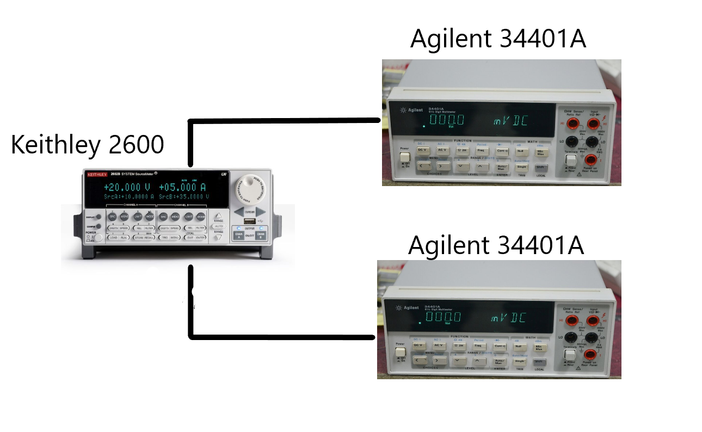

---
jupytext:
  text_representation:
    extension: .md
    format_name: myst
    format_version: 0.13
    jupytext_version: 1.14.1
kernelspec:
  display_name: Python 3
  language: python
  name: python3
---

# QCoDeS Example with Agilent 34400A

+++

This notebook shows how to work with Agilent 34400A instrument qcodes driver and conduct measurements. Agilent 34400A qcodes driver works well for Agilent/HP 34401A instrument and these of two instruments have been used with Keithley 2600 equipment for testing purposes of this notebook. Image below shows the setup.

+++



+++

Two Agilent 34400A instruments can be connected to a Keithley 2600 equipment simultaneously using a custom made connector. This connector connects to the Keithley 2600 equipment through two channels on the back panel as shown below.

+++


+++

In this notebook, we show how to conduct measurements with help of one Agilent/HP 34401A instrument connected with a Keithley 2600 equipment and then with two Agilent/HP 34401A instrument connected to two different channels of Keithley through a custom made connector. In the second scenario, measurment happens simultaneously.

Lets begin...

## Imports

```{code-cell} ipython3
%matplotlib nbagg
import matplotlib.pyplot as plt
import os
import numpy as np

import qcodes.instrument_drivers.tektronix.Keithley_2600_channels as keith
import qcodes.instrument_drivers.agilent.Agilent_34400A as agi
from qcodes.dataset import load_or_create_experiment, Measurement
from qcodes.dataset.plotting import plot_dataset
```

## Initialize instruments

```{code-cell} ipython3
k1 = keith.Keithley_2600('Keithley1', address='GPIB0::26::INSTR')
a1 = agi.Agilent_34400A('Agilent2', 'GPIB0::5::INSTR')
a2 = agi.Agilent_34400A('Agilent1', 'GPIB0::4::INSTR')


# set integration time (number of line cycles)
a1.NPLC.set(10)
a2.NPLC.set(10)
```

## Station creation with initialized instruments

+++

Above initialized instruments can be registered as components to your station by following instructions as mentioned in [15 min of QCoDeS Notebook](../15_minutes_to_QCoDeS.ipynb)

+++

## Load an experiment or create a new one

```{code-cell} ipython3
tutorial_exp = load_or_create_experiment('tutorial_experiment', sample_name= 'no_sample')
```

## Measurements

+++

Here, we use our Keithley k1 as the voltage source, and our Agilent a1 for measuring the voltage generated by k1. So, here we expect our generated data to be the same as measured ones, which we will plot shortly.

```{code-cell} ipython3
meas1 = Measurement(exp=tutorial_exp)
meas1.register_parameter(k1.smua.volt)
meas1.register_parameter(a1.volt, setpoints=[k1.smua.volt])

with meas1.run() as datasaver:
    for set_v in np.linspace(-5, 5, 21):
        k1.smua.volt.set(set_v)
        datasaver.add_result((k1.smua.volt,k1.smua.volt()), (a1.volt, a1.volt()))
dataset = datasaver.dataset
```

```{code-cell} ipython3
axes, cbax = plot_dataset(dataset)

for i in range(1):
    axes[i].lines[0].set_marker('o')
    axes[i].lines[0].set_markerfacecolor((0.6, 0.6, 0.9))
    axes[i].lines[0].set_markeredgecolor((0.4, 0.6, 0.9))
    axes[i].lines[0].set_color((0.8, 0.8, 0.8))
```

We repeat above using two Agilent DMMs to measure voltage generated from both Keithley channels simultaneously:

```{code-cell} ipython3
meas2 = Measurement(exp=tutorial_exp)
meas2.register_parameter(k1.smua.volt)
meas2.register_parameter(k1.smub.volt)
meas2.register_parameter(a1.volt, setpoints=[k1.smua.volt])
meas2.register_parameter(a2.volt, setpoints=[k1.smub.volt])
```

```{code-cell} ipython3
with meas2.run() as datasaver:
    for set_v in np.linspace(-5, 5, 21):
        k1.smua.volt(set_v)
        k1.smub.volt(set_v)
        datasaver.add_result(
            (k1.smua.volt, k1.smua.volt()),
            (k1.smub.volt, k1.smub.volt()),
            (a1.volt, a1.volt()),
            (a2.volt, a2.volt()))
dataset2 = datasaver.dataset
```

```{code-cell} ipython3
axes, cbax = plot_dataset(dataset2)

for i in range(2):
    axes[i].lines[0].set_marker('o')
    axes[i].lines[0].set_markerfacecolor((0.6, 0.6, 0.9))
    axes[i].lines[0].set_markeredgecolor((0.4, 0.6, 0.9))
    axes[i].lines[0].set_color((0.8, 0.8, 0.8))
```
