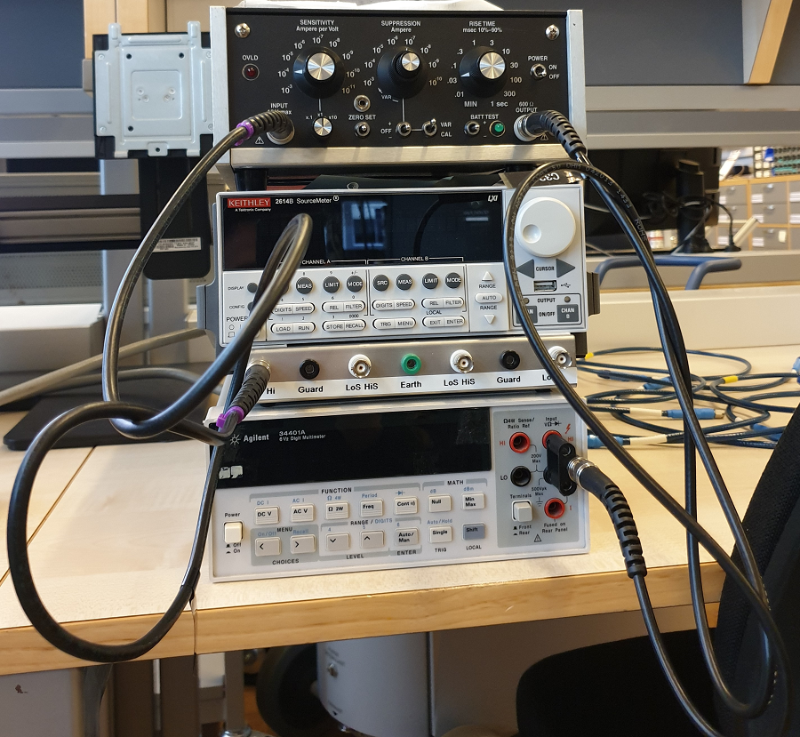

---
jupytext:
  text_representation:
    extension: .md
    format_name: myst
    format_version: 0.13
    jupytext_version: 1.14.1
kernelspec:
  display_name: Python 3
  language: python
  name: python3
---

# QCoDeS Example with Itacho

+++

In this notebook, we show how to use Itacho in a simple setup. We sweep the current using a Keithley 2614B sourcemeter as the current source. Itacho 1211 will convert the current to voltage and we readout the voltage using a DMM Agilent 34401A. Our test setup is as the following picture:

+++



+++

### Required imports

```{code-cell} ipython3
import time
from qcodes.instrument.parameter import Parameter

from qcodes.utils.dataset.doNd import do1d
from qcodes.dataset.plotting import plot_dataset
from qcodes import load_by_run_spec, load_or_create_experiment,\
initialise_or_create_database_at

from qcodes.instrument_drivers.tektronix.Keithley_2600_channels import\
Keithley_2600 as keith
import qcodes.instrument_drivers.agilent.Agilent_34400A as agi
import qcodes.instrument_drivers.ithaco.Ithaco_1211 as ithaco
```

```{code-cell} ipython3
from qcodes.logger import start_all_logging
start_all_logging()
```

### Connecting to the instruments

```{code-cell} ipython3
a1 = agi.Agilent_34400A('Agilent1', 'GPIB0::4::INSTR')
k1 = keith('Keithley', 'GPIB0::26::INSTR')
```

Itacho QCoDeS driver is only a virtual driver without any communication with the instrument. The instrument setting are only controlled via the front and back panel and the used QCoDeS setting must match its corresponding setting on the panel. Now, we instantiate an instance of the instrument:

```{code-cell} ipython3
camp = ithaco.Ithaco_1211('camp')
```

### Configuration

+++

We set Ampere per Volt Sensitivity here, which match with the setting on the instrument panel (the rest of the setting are set according to their default values in the driver): 

```{code-cell} ipython3
camp.sens.set(1e-4)
```

Now, we use CurrentParameter class of Itacho to setup the following parameter, which is showing the fed current to the instantiated camp and converted voltage sent to our connected DMM via a1.volt.

```{code-cell} ipython3
curr = ithaco.CurrentParameter(a1.volt, camp)
```

Let's look at the present value of curr (the sourcemeter is not connected yet):

```{code-cell} ipython3
curr()
```

The current value is practically zero. The voltage value is the current value divided by 1e-4 A/V according to the setting camp.sens.set(1e-4). Thus, Itacho converts the feed to voltage and amplifies it. Let's look at the units of curr:

```{code-cell} ipython3
curr.units
```

Our connected DMM reads a similar voltage value:

```{code-cell} ipython3
a1.volt()
```

We set the integration time of our DMM as below:

```{code-cell} ipython3
a1.NPLC.set(1)
```

Let's look at the snapshot of our created Itacho instance

```{code-cell} ipython3
camp.snapshot()
```

### Setting up qcodes database and performing a simple measurement

+++

Now, we want to feed our Itacho using our Keithley sourcemeter and run a simple qcodes measurement to see the output of the swept values passing through Itacho (for knowing how our sourcemeter works, you can refer to its qcodes notebook in the following:
[Qcodes example with Keithley 2600][mylink]

[mylink]: ./Qcodes%20example%20with%20Keithley%202600.ipynb

+++

We initilize a database named "itacho_db.db" and save our measured data there. Then, we create an experiment named "Itacho_measurement" or load it if is already created:

```{code-cell} ipython3
initialise_or_create_database_at('itacho_db.db')
exp = load_or_create_experiment('Itacho_measurement', sample_name='no sample')
```

Now, we would like to use qcodes do1d function to sweep over current values
generated by our sourcemeter. The current is fed to Itacho and we measure the converted and amplified voltage using the instantiated curr parameter. Qcodes Measurement can be also used for the same reason, instead.
We set our sourcemeter in the 'current' mode and sweep from 1e-6 A to 1e-3 A in 20 steps with 1 second interdelay between each two consecutive steps:

```{code-cell} ipython3
k1.smua.mode('current')
```

```{code-cell} ipython3
t1 = time.time()
do1d(k1.smua.curr, 1e-6, 1e-3, 20, 1, curr, do_plot=False)
t2 = time.time()
print(f'Measurement took {t2-t1} seconds')
```

As expected, the measurement took around 20 seconds. Now, we want to plot our measured dataset. We use qcodes to find the dataset that we want to plot in the database, and tweak plotting axes for showing it in a scatter plot. 

```{code-cell} ipython3
exp.data_set
```

```{code-cell} ipython3
dataset = load_by_run_spec(experiment_name='Itacho_measurement',\
                           captured_run_id=4)
```

```{code-cell} ipython3
axes, cbax = plot_dataset(dataset)
for i in range(2):
    axes[i].lines[0].set_marker('o')
    axes[i].lines[0].set_markerfacecolor((0.6, 0.6, 0.9))
    axes[i].lines[0].set_markeredgecolor((0.4, 0.6, 0.9))
    axes[i].lines[0].set_color((0.8, 0.8, 0.8))
```

We see two results in the figure above; the first and second figures are the converted voltages and fed current, respectively against the swept current. If we look at our attached DMM, we see that it is showing -10.00 V DC, which is the same as the final voltage value in the first figure. Therefore, both results are as expected and showing that our Ithaco's virtual driver is performing as it should.

+++

Let's explore our dataset, because why not :)

```{code-cell} ipython3
dataset.to_pandas_dataframe_dict()
```

In the above two tables, Keithley_smua_curr in both tables are the swept current values generated by our sourcemeter. The top table's second column (with the title curr) is showing the current values and the bottom table's second column (volt_raw) is showing voltage values of our Itacho's curr parameter.
