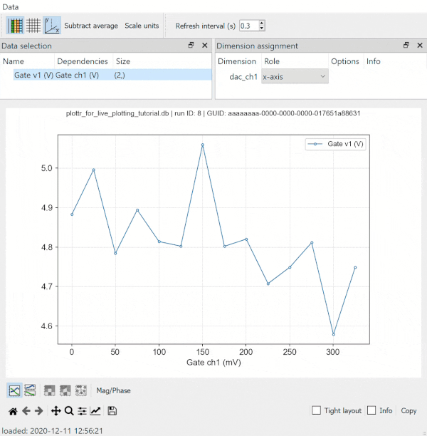

---
jupytext:
  text_representation:
    extension: .md
    format_name: myst
    format_version: 0.13
    jupytext_version: 1.14.1
kernelspec:
  display_name: Python 3
  language: python
  name: python3
---

# How to use Plottr with QCoDeS for live plotting?

Note: This notebook assumes that the user has a `conda` environment on their system with latest versions of `plottr` installed. It is not necessary to have plottr installed in measurements environment itself. Plottr can be in a separate environment as well. If you do not have plottr installed, please follow [Plottr Quickstart (Installation)](https://github.com/toolsforexperiments/plottr#quickstart) instructions.

Let's begin!

First, make necessary imports.

```{code-cell} ipython3
import os
import numpy as np

import qcodes as qc
from qcodes import Station, initialise_or_create_database_at, \
    load_or_create_experiment, Measurement
from qcodes.tests.instrument_mocks import DummyInstrument, \
    DummyInstrumentWithMeasurement
from qcodes.utils.dataset.doNd import do1d

qc.logger.start_all_logging()
```

## Mock Set-up

For this notebook, we create a mock station setup. 

```{code-cell} ipython3
dac = DummyInstrument('dac', gates=['ch1', 'ch2'])
dmm = DummyInstrumentWithMeasurement(name='dmm', setter_instr=dac)

station = qc.Station(dmm, dac)
```

## Initialize/Create Database

Database needs to be initialized or created if it doesn't exist already, using `initialize_or_create_database` method. Furthermore, datasets are associated with experiments and by default the run is appended to the latest existing experiment. We can load or create an experiment using `load_or_create_experiment` function. 

```{code-cell} ipython3
db_file_path = os.path.join(os.getcwd(), 'plottr_for_live_plotting_tutorial.db')
initialise_or_create_database_at(db_file_path)
exp = load_or_create_experiment(experiment_name='plottr_for_live_plotting_with_subsecond_refresh_rate',
                          sample_name="no sample")
```

## Launch Plottr Inspectr 

Open an anaconda prompt and activate your conda environment where plottr is installed. Start Inspectr GUI with `plottr-inspectr` command (more details for launching Inspectr are [here](https://github.com/toolsforexperiments/plottr#inspectr-qcodes-dataset-inspection-and-live-plotting). You will see a window as show below. In this window, set `Refresh interval (s)` to the desired value and check `Auto-plot new`. Using `File` button, load the database initialized/created above (Alternatively, database can be dragged and dropped on the Inspectr window).


On selection, refresh interval and auto-plot new checkbox will look like as follows.


### If plottr is installed in same environment as measurements environment

Plottr-inspectr can also be launched with required DB as follows.

```{code-cell} ipython3
import IPython.lib.backgroundjobs as bg
from plottr.apps import inspectr

jobs = bg.BackgroundJobManager()
jobs.new(inspectr.main, db_file_path)
```

Set refresh interval and auto-plot new as mentioned above. 

+++

## Measurement

Measurements can be run in two ways.

### Measurement with run context manager

Notice `write_period = 0.1` . This sets the measurement write period to 0.1s and is recommended to be used with sub-second refresh interval for plottr.

```{code-cell} ipython3

meas = Measurement(exp=exp)
meas.register_parameter(dac.ch1)
meas.register_parameter(dmm.v1, setpoints=(dac.ch1,))

meas.write_period = 0.1

with meas.run() as datasaver:

    for set_v in np.linspace(0, 25, 100):
        dac.ch1.set(set_v)
        get_v = dmm.v1.get()
        datasaver.add_result((dac.ch1, set_v),
                             (dmm.v1, get_v))
        
    dataset = datasaver.dataset
```

### Measurement with doNd

```{code-cell} ipython3
do1d(dac.ch1, 0, 25, 100, 0.01, dmm.v1, dmm.v2, write_period=0.1, do_plot=False)
```

On starting these measurements, a plottr plot window (as shown below) will open automatically. This plot will keep refreshing at the interval rate set by you till the measurement runs.

+++

## Live Plot



For more details about Plottr, head to [Plottr Documentation](https://plottr.readthedocs.io/en/latest/index.html)

```{code-cell} ipython3

```
